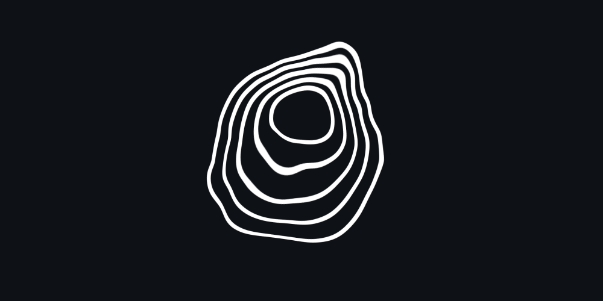

# Image Refractor

A canvas-based web-component for applying animated water-like refraction effects to images.



:wave: [Check out the demo](https://marcantondahmen.github.io/image-refractor/)

## Getting Started

You can either install this [package](https://www.npmjs.com/package/image-refractor)
with `npm` and import it into your JavaScript or TypeScript project or use it in a browser.

### NPM

Install with `npm`:

```
npm i --save image-refractor
```

Import into your project as follows in order to register the custom web-component:

```javascript
import 'image-refractor';
```

### CDN

Alternatively just load it from a CDN as follows:

```html
<script src="https://unpkg.com/image-refractor/dist/image-refractor.js"></script>
```

## Usage

After importing the component, it can simply be used like any other HTML element:

```html
<image-refractor
  width="1000"
  height="1000"
  refract="1.333"
  speed="0.03"
  intensity="1.0"
  src="https://domain.com/image.png"
></image-refractor>
```

## Options

The component can be configured using the following attributes:

| Attribute   | Description                                                                                           |
| ----------- | ----------------------------------------------------------------------------------------------------- |
| `src`       | The texture image                                                                                     |
| `width`     | The rendered image width in pixels. This describes the canvas resolution.                             |
| `height`    | The rendered image height in pixels. Also here, the height is used to describe the canvas resolution. |
| `refract`   | The refraction index that is used.                                                                    |
| `speed`     | The animation speed. Good values are between `0.01` and `0.1`.                                        |
| `intensity` | The intensity of the underlaying noise. Higher values generate higher distortion.                     |

## Acknowledgements

Thanks to **SuperHi** for the great inspiration [video](https://www.youtube.com/watch?v=GALjY57ntsk) and
[Yi-Wen Lin](https://github.com/yiwenl) for his [fbm](https://github.com/yiwenl/glsl-fbm/blob/master/2d.glsl) implementation.
